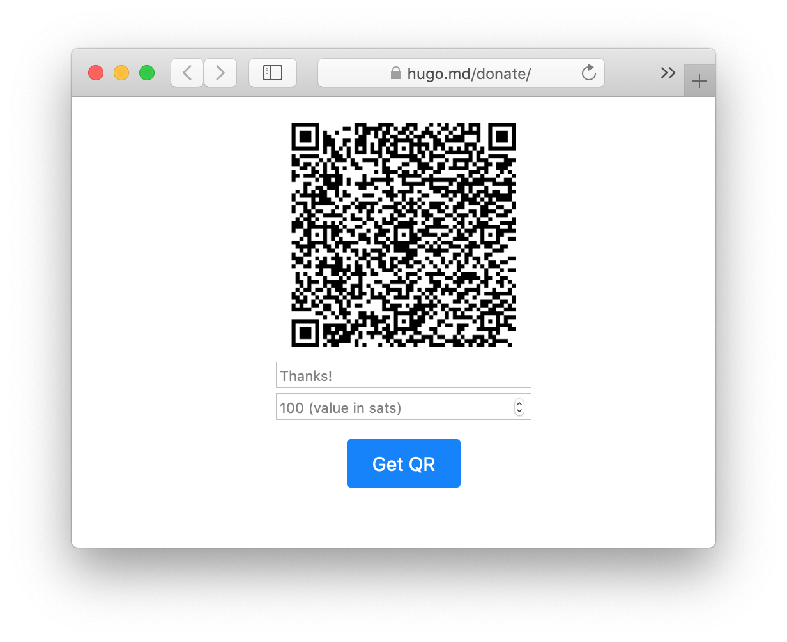

# lnd-invoice

Hosts a tiny API that generates a QR code for a Bitcoin Lightning invoice.

## Demo
You can try it out here: https://lightning.hugo.md/




## Usage
```
docker run \
  -p 8080:8080 \
  -e LND_IP="10.0.0.1" \
  -e LND_PORT="8080" \
  -e MACAROON_BASE64="YOUR_MACAROON" \
  docker.pkg.github.com/hugomd/lnd-invoice/lnd-invoice:latest
```

However GitHub Packages doesn't allow non-auth'd pulling, so I'll be pushing this to Docker Hub shortly for public usage.
